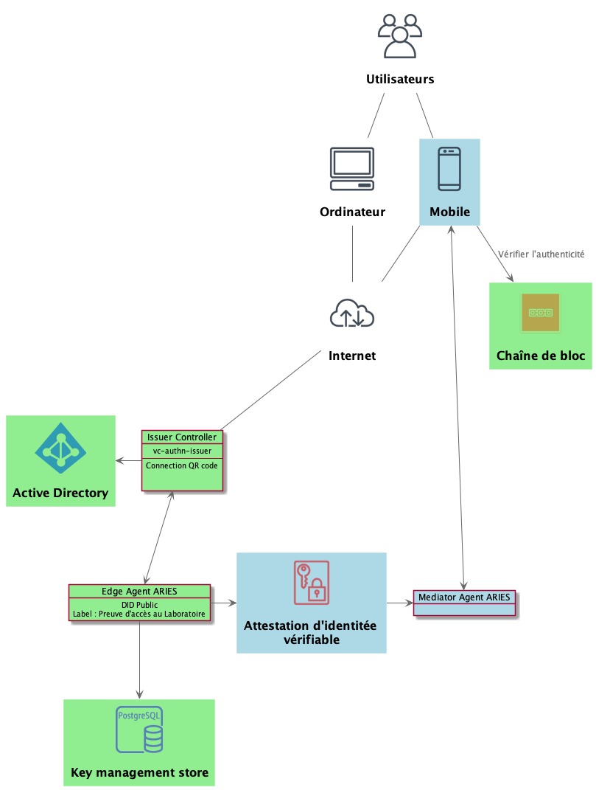
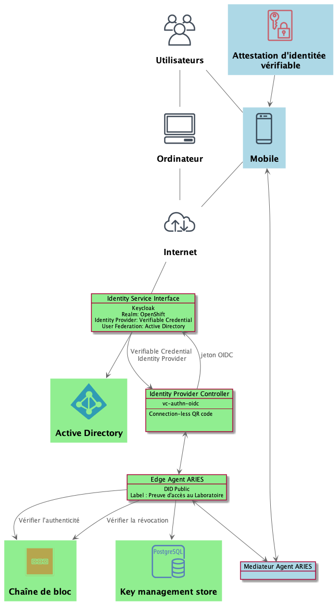
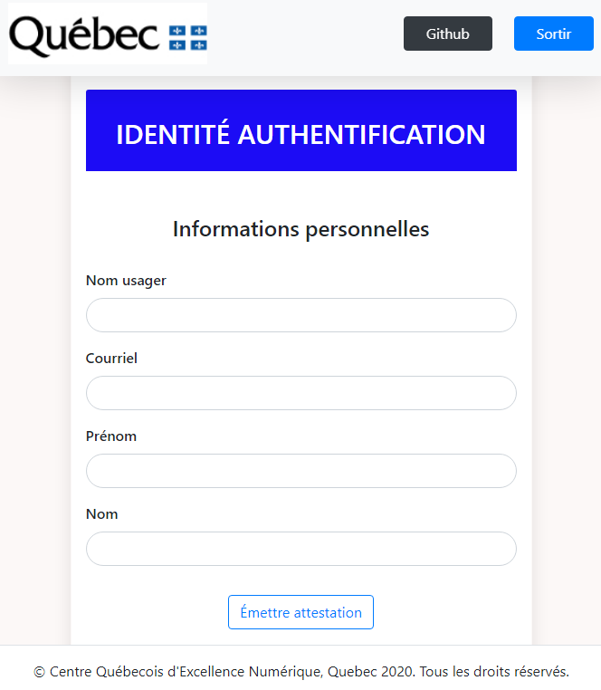
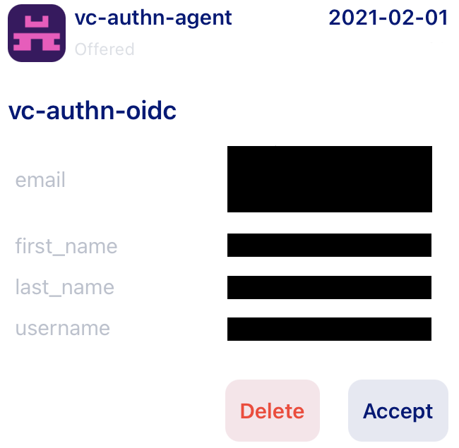
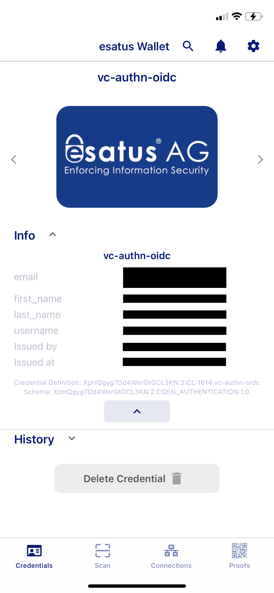
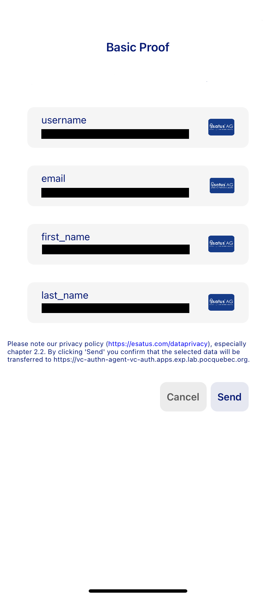

[](https://www.quebec.ca/gouv/politiques-orientations/vitrine-numeriqc/accompagnement-des-organismes-publics/demarche-conception-services-numeriques)
[](LICENSE)
# Authentification par attestation d'identitée vérifiable via OpenID Connect
Voici les travaux réalisés dans le cadre d'une expérimentation basée sur le concept de l'identité numérique. Le sujet: l'émission d'une [attestation d'identité vérifiable](https://www.w3.org/TR/vc-data-model) permettant l'authentification via [OpenID Connect](https://openid.net/connect). 
## Table des matières

1. [Objectifs](#10-objectifs)

2. [Contexte](#20-contexte)

3. [Environnement d\'expérimentation](#30-environnement-dexpérimentation)

   1. [Conditions initiales et prémisses](#31-conditions-initiales-et-prémisses)

4. [Démarche](#40-démarche)

5. [Attestation d'identité numérique](#50-le-contenu-de-lattestation)

6. [Résultats attendus](#60-résultats-attendus)

7. [Analyse](#70-analyse)

8. [Conclusion](#80-conclusion)

9. [Licence](#90-licence)

---

## 1.0 Objectifs

- Permettre à un utilisateur de s'authentifier via un fournisseur OpenID Connect, par exemple [Keycloak](https://www.keycloak.org/), en présentant une attestation d'identitée vérifiable.

- Émettre des attestations d'identitée vérifiables d'authentification aux utilisateurs qui le désirent.

- Démontrer la possibilité d'étendre le fournisseur OpenID standard (Keycloak) afin qu'il prenne en charge l'authentification à partir d'un justificatif d'identité vérifiable.

- Configurer une partie dépendante (relying party)(Openshift) pour utiliser cette méthode d'authentification.
## 2.0 Contexte

Une [attestation d'identitée vérifiable](https://www.w3.org/TR/vc-data-model) est essentiellement un ensemble d'affirmations délivrées par une autorité de confiance que l'on nomme habituellement: "Émetteur". Ces affirmations sont faites sur un sujet (une personne, une compagnie, etc.) de telle sorte que, lorsqu'elles sont présentées à un vérificateur, leur authenticité peut être vérifiée de manière cryptographique.

OpenID Connect est un protocole d'authentification basé sur [OAuth2.0](https://oauth.net/2). Dans une implémentation standard, une partie utilisatrice va former une demande d'authentification puis elle l'envoie à un fournisseur OpenID de confiance qui se charge d'authentifier l'utilisateur au nom de la partie utilisatrice. Le fournisseur OpenID gère et conserve les identités réelles des utilisateurs et la manière de les authentifier. Twitter, Facebook et Github sont des fournisseurs OpenID Connect parmi les plus populaires. Pour authentifier et identifier un utilisateur, le fournisseur OpenID lui demande, le plus souvent, un nom d'utilisateur et un mot de passe. Avec ces informations, il construit un jeton d'identité et le renvoie à la partie utilisatrice. Ici, la question posée par la partie utilisatrice doit être la suivante : pouvez-vous demander à cet utilisateur de présenter une attestation d'identitée vérifiable qui répond à ces contraintes? Lorsque la partie utilisatrice qui se fie à l'authentification utilise cette méthode, elle peut imposer un ensemble de contraintes, dont voici quelques exemples :

- Émetteur du justificatif - Par qui a-t-il été émis?
- Schéma du justificatif - De quel type de justificatif s'agit-il ?
- Attributs du justificatif - Quels sont les affirmations qui présentent un intérêt ?

Le résultat final pour une partie utilisatrice est le même qu'avec le flux OpenID Connect traditionnel en ce sens qu'elle obtient ce que l'on appelle un jeton d'identité, la seule différence réelle étant la manière dont ce jeton est construit. Plutôt que d'être alimenté sur la base des informations de l'utilisateur détenues par le fournisseur OpenID, il est construit en utilisant les affirmations dans l'attestation d'identitée vérifiables que l'utilisateur présente.
## 3.0 Environnement d\'expérimentation

### Construit avec
* [C#](https://docs.microsoft.com/en-us/dotnet/csharp/), [React](https://fr.reactjs.org)

### Prérequis

* [npm](https://www.npmjs.com)
* [Docker](https://www.docker.com)
* [von-network](https://github.com/bcgov/von-network)
* [esatus](https://apps.apple.com/ca/app/esatus-wallet/id1496769057), [trinsic](https://apps.apple.com/ca/app/trinsic-wallet/id1475160728)
* [ngrok](https://ngrok.com/)

### Facultatifs

* [VSCode](https://code.visualstudio.com)
* [Debugger for Chrome](https://marketplace.visualstudio.com/items?itemName=msjsdiag.debugger-for-chrome)

### Déploiement
Voir les instructions de [déploiment sur OpenShift](openshift/templates/README.md).

### 3.1 Conditions initiales et prémisses

- Un (1) portefeuille numérique appartenant à l'utilisateur est disponible, sur lequel son attestation d'identité vérifiable est émise;

- Un répertoire distribué identitaire se conformant au _framework_
  _ARIES_ est en place et permet d\'émettre des attestations ainsi que les schémas associés;

- Un émetteur d\'attestation représentant l\'organisme qui octroie l'accès est en place;

- Un consommateur d\'attestation est en place à travers le service d'authentification représenté par le fournisseur d\'identité;

- Une vérification d'identité n'est pas requise pour émettre l'attestation d'identité dans la démo;

- Les notifications et publications entre les intervenants ne sont pas de la portée de l\'expérimentation. On assume qu\'elles sont exécutées de manière appropriée lorsque mentionnées;

- L'organisme émetteur consigne la relation entre l'utilisateur et son organisme dans le répertoire d'accès.

Voici l\'architecture des composants nécessaires à haut niveau pour émettre une attestation d\'identité vérifiable à un utilisateur.

<p align="center">
  

  <br>
  <b>Émission de l'attestation d'identité vérifiable à l'utilisateur</b>
</p>

---

Voici l\'architecture des composants nécessaires à haut niveau pour consommer l\'attestation d\'identité vérifiable d\'un utilisateur via une authentification OpenID Connect.

<p align="center">
  

  <br>
  <b>Consommation de l'attestation d'identité vérifiable via une authentification OpenID Connect</b>
</p>

## 4.0 Démarche

1. Effectuer le [déploiment sur OpenShift](openshift/templates/README.md).

2. Installer le porte-feuille d'identité numérique [esatus](https://esatus.com/esatus-ssi-wallet-app-ab-sofort-fuer-ios-und-android-verfuegbar/?lang=en) sur un téléphone mobile.

3. Sélectionner le réseau vonx.pocquebec.

4. Accéder à l'application d'émission.

5. Saisir les informations demandées.

<p align="center">
  
</p>

6. Cliquer sur le bouton "Émettre attestation".

7. Scanner le code QR avec le porte-feuille d'identité numérique.

8. Dans la fenêtre de dialogue "vc-authn-agent - wants to connect with you", cliquer sur "Connect" et ensuite sur "Close".

9. Dans la fenêtre de dialogue "New Credential - You've got a new Credential Offer from vc-authn-agent", cliquer sur "View Offer" et ensuite sur "Close".

10. Accepter l'attestation.

<p align="center">
  
</p>

<p align="center">
  
</p>

11. Accéder à la console [Openshift](https://console-openshift-console.apps.exp.lab.pocquebec.org/dashboards).

12. Sur la page "Log in with...", cliquer sur "openid".

13. Sur la page "OPENSHIFT Log In", cliquer sur "Verifiable Credential".

14. Scanner le code QR avec le porte-feuille d'identité [Esatus](https://esatus.com/esatus-ssi-wallet-app-ab-sofort-fuer-ios-und-android-verfuegbar/?lang=en).

15. Sur la fenêtre "New Request", cliquer sur "View Request".

16. Sur la page "Basic Proof", cliquer sur "Send".

<p align="center">
  
</p>

17. Sur la fenêtre "Sending successful", cliquer sur "Finish".

## 5.0 Le contenu de l'Attestation

Voici le schéma de données utilisé pour l\'attestation d\'identité numérique ainsi que pour sa délégation:
Schema name: CQEN_AUTHENTICATION
Schema version: 1.0
```json
{
  "schema_name": "CQEN_AUTHENTICATION",
  "schema_version": "1.0",
  "attributes": [
    "first_name",
    "email",
    "username",
    "last_name"
  ]
}
```

Par exemple, l\'attestation d\'identité d\'authentification pourrait être composée des valeurs suivantes:
|Nom de l'attribut | Valeurs |
|----------|---------|
|username | user01 |
|email | prenom.nom@sct.gouv.qc.ca |
|first_name | Prénom |
|last_name | Nom |

---

<b>Tableau 1 - Données de l\'attestation d\'identité d\'authentification</b>

## 6.0 Résultats attendus

Après l'émission d'un justificatif d'identité vérifiable dans le porte-feuille d'identité numérique, il a été possible de s'authetifier sur le cluster [Openshift](https://console-openshift-console.apps.exp.lab.pocquebec.org/dashboards) sans saisir d'usager/mot de passe.

## 7.0 Analyse

Le but de l'expérience était de démontrer s'il est possible d'étendre le fournisseur OpenID standard Keycloak afin qu'il prenne en charge l'authentification à partir d'une attestation vérifiable. En utilisant le Keycloak configuré pour sécuriser l'accès à notre cluster [Openshift](https://console-openshift-console.apps.exp.lab.pocquebec.org/dashboards), il a été possible de s'authentifier à partir d'une attestation vérifiable émise dans le porte-feuille d'identité [Esatus](https://esatus.com/esatus-ssi-wallet-app-ab-sofort-fuer-ios-und-android-verfuegbar/?lang=en).

Afin de réduire le risque d'accès frauduleux, il est important d'accorder une attention particulière à la sécurité des composantes mise en place. L'application émettrice d'attestion doit être accessible uniquement par un minimum de personne. Elle doit être protégée au minimum par un usager/mot de passe. Dans cette expérimentation, étant donné que le Keycloak offrait déjà l'authentification par Active Directory (AD), il a été paramétré pour forcer la présence d'un compte avec le même nom d'usager dans l'Active Directory lors de l'authentification par attestation vérifiable. Il serait également pertinent de sécuriser l'accès à l'url de l'application émétrice à un usager préalablement authentifier sur le cluster Openshift.

## 8.0 Conclusion
L'authentification par attestation vérifiable via un fournisseur OpenID standard est tout à fait possible et elle a été clairement démontrée lors de cette expérience. Cette méthode d'authentification offre la possibilité de mettre en place un environmenet dans lequel l'usager n'a plus à saisir de mot de passe (et n'a plus à les renouveler).
## 9.0 Licence

Distribué sous Licence Libre du Québec – Réciprocité (LiLiQ-R). Voir [LICENCE](LICENSE) pour plus d'informations.
