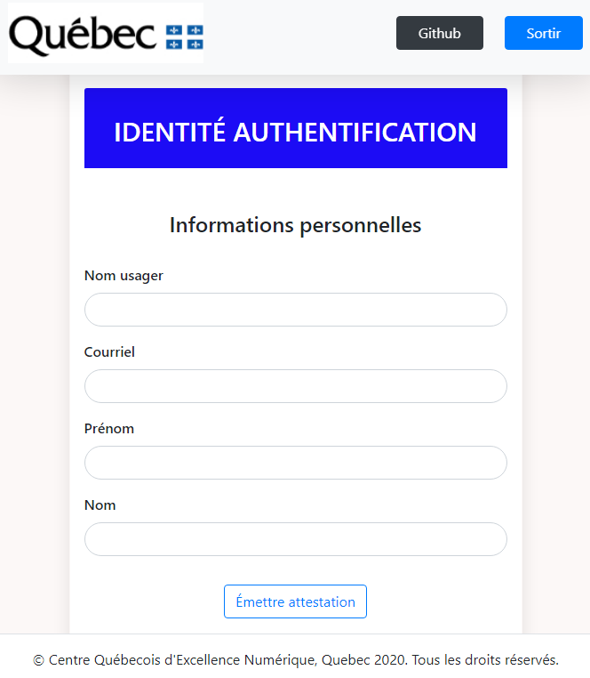
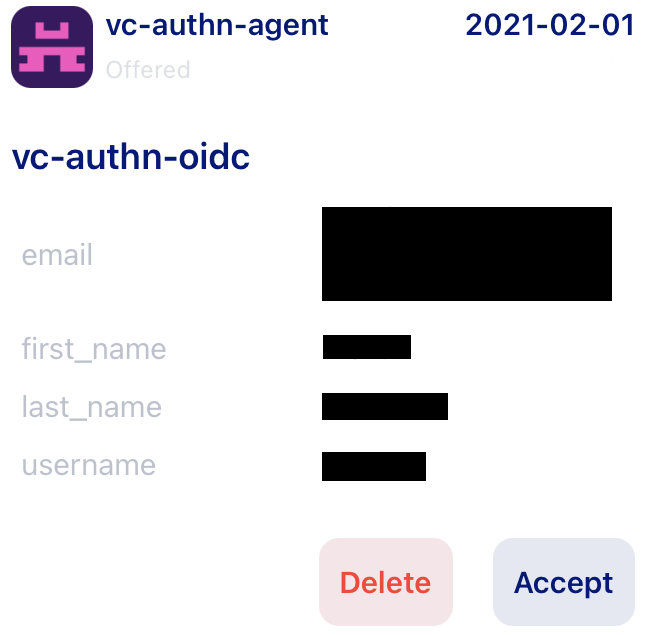
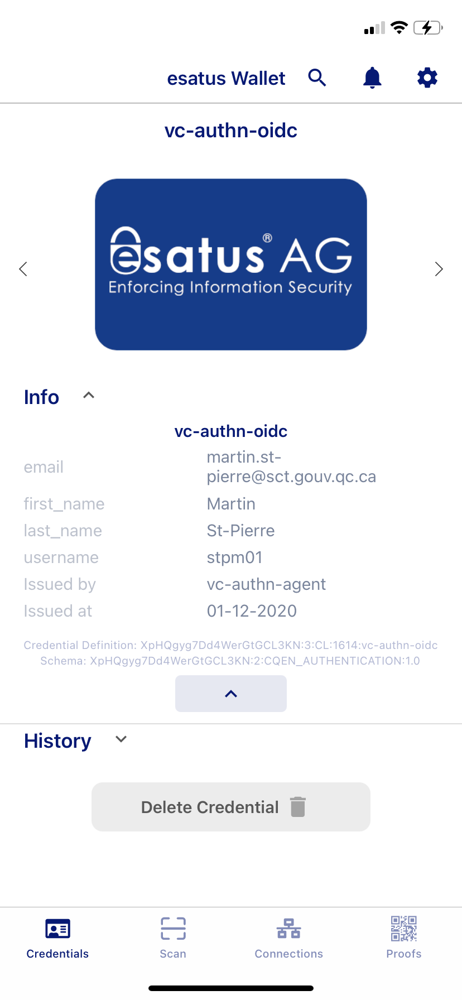
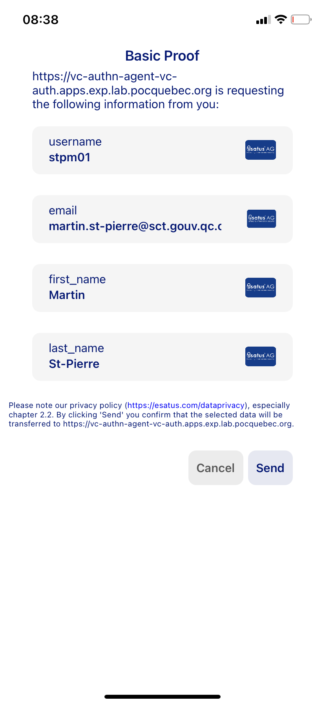

# Authentification par justificatif d'identité vérifiable via OpenID Connect

## Objectif

* Démontrer la possibilité d'étendre le fournisseur OpenID standard (Keycloak) afin qu'il prenne en charge l'authentification à partir d'un justificatif d'identité vérifiable.

* Configurer une partie dépendante (relying party)(Openshift) pour utiliser cette méthode d'authentification

## Démarche

1. Effectuer le [déploiment sur OpenShift](../../openshift/templates/README.md).

2. Installer le porte-feuille d'identité numérique [esatus](https://esatus.com/esatus-ssi-wallet-app-ab-sofort-fuer-ios-und-android-verfuegbar/?lang=en) sur un téléphone mobile.

3. Sélectionner le réseau vonx.pocquebec.

4. Accéder à l'application d'émission.

5. Saisir les informations demandées.

6. Cliquer sur le bouton "Émettre attestation".

7. Scanner le code QR avec le porte-feuille d'identité numérique.

8. Dans la fenêtre de dialogue "vc-authn-agent - wants to connect with you", cliquer sur "Connect" et ensuite sur "Close".

9. Dans la fenêtre de dialogue "New Credential - You've got a new Credential Offer from vc-authn-agent", cliquer sur "View Offer" et ensuite sur "Close".

10. Accepter l'attestation.

11. Accéder à la console [Openshift](https://console-openshift-console.apps.exp.lab.pocquebec.org/dashboards).

12. Sur la page "Log in with...", cliquer sur "openid".

13. Sur la page "OPENSHIFT Log In", cliquer sur "Verifiable Credential".

14. Scanner le code QR avec le porte-feuille d'identité [Esatus](https://esatus.com/esatus-ssi-wallet-app-ab-sofort-fuer-ios-und-android-verfuegbar/?lang=en).

15. Sur la fenêtre "New Request", cliquer sur "View Request".

16. Sur la page "Basic Proof", cliquer sur "Send".

17. Sur la fenêtre "Sending successful", cliquer sur "Finish".

## Résultats

Après l'émission d'un justificatif d'identité vérifiable dans le porte-feuille d'identité numérique, il a été possible de s'authetifier sur le cluster [Openshift](https://console-openshift-console.apps.exp.lab.pocquebec.org/dashboards) sans saisir d'usager/mot de passe.

## Analyse

Le but de l'expérience était de démontrer s'il est possible d'étendre le fournisseur OpenID standard Keycloak afin qu'il prenne en charge l'authentification à partir d'une attestation vérifiable. En utilisant le Keycloak configuré pour sécuriser l'accès à notre cluster [Openshift](https://console-openshift-console.apps.exp.lab.pocquebec.org/dashboards), il a été possible de s'authentifier à partir d'une attestation vérifiable émise dans le porte-feuille d'identité [Esatus](https://esatus.com/esatus-ssi-wallet-app-ab-sofort-fuer-ios-und-android-verfuegbar/?lang=en).

Afin de réduire le risque d'accès frauduleux, il est important d'accorder une attention particulière à la sécurité des composantes mise en place. L'application émettrice d'attestion doit être accessible uniquement par un minimum de personne. Elle doit être protégée au minimum par un usager/mot de passe. Dans cette expérimentation, étant donné que le Keycloak offrait déjà l'authentification par Active Directory (AD), il a été paramétré pour forcer la présence d'un compte avec le même nom d'usager dans l'Active Directory lors de l'authentification par attestation vérifiable. Il serait également pertinent de sécuriser l'accès à l'url de l'application émétrice à un usager préalablement authentifier sur le cluster Openshift.

## Conclusion
L'authentification par attestation vérifiable via un fournisseur OpenID standard est tout à fait possible et elle a été clairement démontrée lors de cette expérience. Cette méthode d'authentification offre la possibilité de mettre en place un environmenet dans lequel l'usager n'a plus à saisir de mot de passe (et n'a plus à les renouveler).